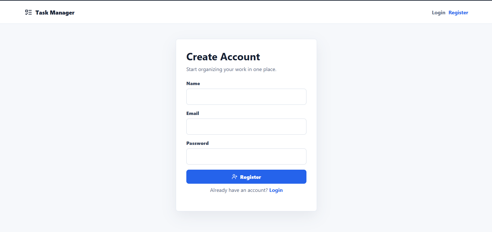
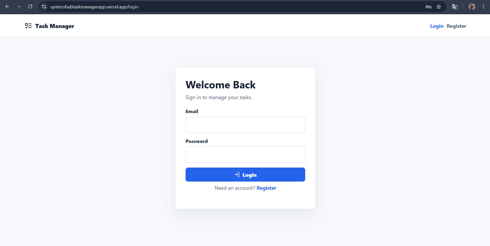
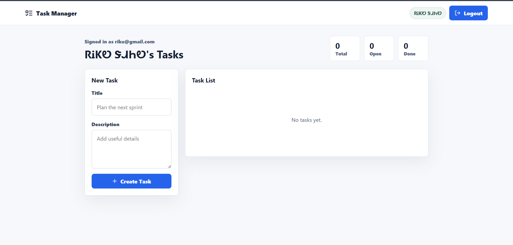
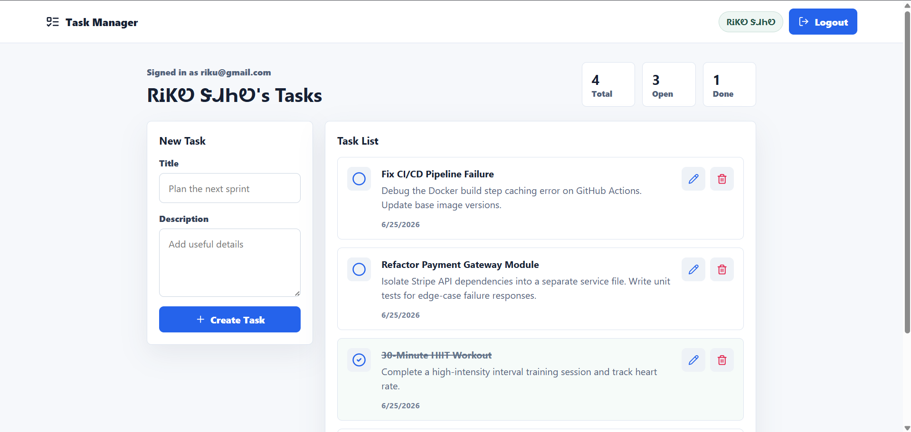
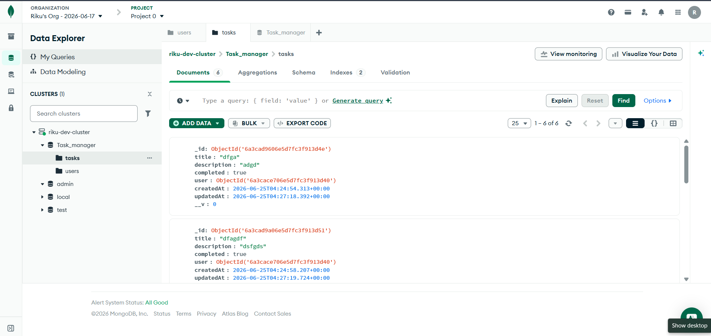
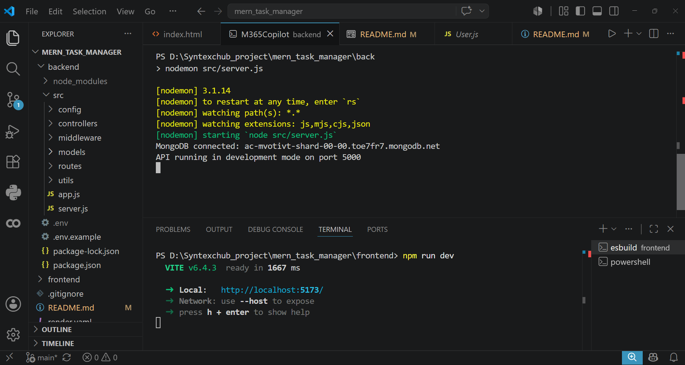

<div align="center">

# 📋 Syntecxhub Task Manager App

**A Full-Stack MERN Task Manager with Secure JWT Authentication**

[](https://reactjs.org/)
[](https://nodejs.org/)
[](https://expressjs.com/)
[](https://www.mongodb.com/atlas)
[](https://jwt.io/)
[](https://syntecxhubtaskmanagerapp.vercel.app/login)
[](https://syntecxhub-task-manager-app-ct2k.onrender.com)

<br/>

[📂 Repository](https://github.com/ItsRiku237/Syntecxhub_Task_Manager_App) &nbsp;·&nbsp; [🐛 Report Bug](https://github.com/ItsRiku237/Syntecxhub_Task_Manager_App/issues) &nbsp;·&nbsp; [✨ Request Feature](https://github.com/ItsRiku237/Syntecxhub_Task_Manager_App/issues)

</div>

<br>

---

<div align="center">

## [🌐 Live Deployment](https://syntecxhubtaskmanagerapp.vercel.app/login)

</div>

<div align="center">

| Layer | Platform | URL |
|-------|----------|-----|
| 🖥️ **Frontend (Live App)** | Vercel | [syntecxhubtaskmanagerapp.vercel.app](https://syntecxhubtaskmanagerapp.vercel.app/login) |
| ⚙️ **Backend (REST API)** | Render | [syntecxhub-task-manager-app-ct2k.onrender.com](https://syntecxhub-task-manager-app-ct2k.onrender.com) |

</div>

> 💡 The **Vercel link is the actual app** — visit this to register, log in, and manage tasks.
> The **Render link is the backend API only** — it serves data and isn't meant to be browsed directly.
>
> ⚠️ *Note: Render's free tier may "sleep" after inactivity — the first request after idle time can take 20–30 seconds to respond.*

<br>

---

## 🖼 App Screenshots

<br>

### 🔐 Register Page


<br>

### 🔑 Login Page


<br>

### 📋 Dashboard — Task List


<br>

### ➕ Add / Edit Task Form


<br>

### 🧪 Data Base — Mongodb Atlas DB


<br>

### 🖥️ VS Code — Project Structure


<br>

---

## 📖 Table of Contents

- [About the Project](#-about-the-project)
- [Features](#-features)
- [Tech Stack](#-tech-stack)
- [Folder Structure](#-folder-structure)
- [API Routes](#-api-routes)
- [Authentication Flow](#-authentication-flow)
- [Environment Variables](#-environment-variables)
- [Local Setup](#-local-setup)
- [Render Deployment (Backend)](#-render-deployment-backend)
- [Vercel Deployment (Frontend)](#-vercel-deployment-frontend)
- [Production Notes](#-production-notes)
- [Future Improvements](#-future-improvements)
- [Developer](#-developer)
- [Acknowledgements](#-acknowledgements)

<br>

---

## 🎯 About the Project

**Syntecxhub Task Manager App** is a production-ready **MERN stack** application that allows users to register, log in, and manage their own personal task list — fully secured with **JWT authentication**. Built as part of the **Syntecxhub Web Development Internship**, this project demonstrates real-world full-stack development: REST API design, MongoDB Atlas integration, password hashing, protected routes, and a deployed React SPA frontend.

Every task is scoped to the authenticated user — each user only sees and manages their own tasks, never anyone else's.

> 🔒 Auth uses **JWT (JSON Web Tokens)** sent via the `Authorization: Bearer <token>` header, with passwords hashed using **bcryptjs** before being stored in MongoDB.

<br>

---

## ✨ Features

| Feature | Description |
|--------|-------------|
| 🔐 User Registration | Create a new account with hashed password storage |
| 🔑 User Login | JWT-based login with secure token generation |
| 🛡️ Protected Routes | Frontend & backend routes guarded by auth middleware |
| ➕ Create Task | Add new tasks tied to the logged-in user |
| 📖 Read Tasks | View all personal tasks or a single task by ID |
| ✏️ Update Task | Edit task title, description, or status |
| 🗑️ Delete Task | Remove a task permanently |
| ⚠️ Centralized Error Handling | Consistent error responses across the backend |
| 💾 Persistent Auth | Token stored in localStorage for session persistence |
| ☁️ Live Deployment | Frontend on Vercel, backend on Render |

<br>

---

## 🛠 Tech Stack

| Layer        | Technology                          |
|---------------|--------------------------------------|
| Frontend      | React.js + Vite                     |
| Routing       | React Router (Protected Routes)     |
| HTTP Client   | Axios                               |
| Backend       | Node.js + Express.js                |
| Database      | MongoDB Atlas                       |
| ODM           | Mongoose                            |
| Auth          | JWT (jsonwebtoken)                  |
| Password Hash | bcryptjs                            |
| Deployment    | Render (backend) + Vercel (frontend)|

<br>

---

## 📁 Folder Structure

```txt
Syntecxhub_Task_Manager_App/
│
├── 🔧 backend/
│   ├── .env.example
│   ├── package.json
│   └── src/
│       ├── app.js
│       ├── server.js
│       ├── ⚙️ config/
│       │   ├── db.js
│       │   └── env.js
│       ├── 🧠 controllers/
│       │   ├── authController.js
│       │   └── taskController.js
│       ├── 🛡️ middleware/
│       │   ├── authMiddleware.js
│       │   └── errorMiddleware.js
│       ├── 🗄️ models/
│       │   ├── Task.js
│       │   └── User.js
│       ├── 🔗 routes/
│       │   ├── authRoutes.js
│       │   └── taskRoutes.js
│       └── 🧰 utils/
│           ├── AppError.js
│           ├── asyncHandler.js
│           └── generateToken.js
│
├── 💻 frontend/
│   ├── .env.example
│   ├── index.html
│   ├── package.json
│   ├── vercel.json
│   ├── vite.config.js
│   └── src/
│       ├── App.jsx
│       ├── main.jsx
│       ├── styles.css
│       ├── 🌐 api/
│       │   └── axios.js
│       ├── 🧩 components/
│       │   ├── LoadingSpinner.jsx
│       │   ├── Navbar.jsx
│       │   ├── ProtectedRoute.jsx
│       │   ├── TaskForm.jsx
│       │   └── TaskItem.jsx
│       ├── 🔐 context/
│       │   └── AuthContext.jsx
│       ├── 📄 pages/
│       │   ├── Dashboard.jsx
│       │   ├── Login.jsx
│       │   ├── NotFound.jsx
│       │   └── Register.jsx
│       └── 🧰 utils/
│           └── authStorage.js
│
├── 🖼️ screenshots/
│   ├── register.png
│   ├── login.png
│   ├── dashboard.png
│   ├── task_form.png
│   ├── postman_api.png
│   └── vscode_structure.png
│
├── .gitignore
├── render.yaml
└── README.md
```

<br>

---

## 🔗 API Routes

| Method   | Endpoint              | Description                  | Auth Required |
|----------|------------------------|-------------------------------|----------------|
| `POST`   | `/api/auth/register`   | Register a new user           | No |
| `POST`   | `/api/auth/login`      | Log in & receive JWT token     | No |
| `GET`    | `/api/auth/me`         | Get current logged-in user     | ✅ Yes |
| `GET`    | `/api/tasks`           | Get all tasks for current user | ✅ Yes |
| `POST`   | `/api/tasks`           | Create a new task              | ✅ Yes |
| `GET`    | `/api/tasks/:id`       | Get a single task by ID        | ✅ Yes |
| `PATCH`  | `/api/tasks/:id`       | Update a task                  | ✅ Yes |
| `DELETE` | `/api/tasks/:id`       | Delete a task                  | ✅ Yes |

<br>

---

## 🔐 Authentication Flow

1. User **registers** → password is hashed with **bcryptjs** → user saved in MongoDB
2. User **logs in** → credentials verified → server signs and returns a **JWT**
3. Frontend stores the JWT in **localStorage**
4. Every protected request sends the token in the header:
  Authorization: Bearer <token>
5. Backend `authMiddleware.js` verifies the token before allowing access to task routes
6. Tasks are always filtered by the logged-in user's ID — no cross-user data leaks

<br>

---

## 🔑 Environment Variables

### `backend/.env.example`
```env
NODE_ENV=development
PORT=5000
MONGO_URI=your_mongodb_atlas_connection_string
JWT_SECRET=your_long_random_secret
JWT_EXPIRES_IN=7d
CLIENT_URL=http://localhost:5173
```

### `frontend/.env.example`
```env
VITE_API_URL=http://localhost:5000/api
```

> 🔒 Never commit your actual `.env` files — only commit the `.env.example` templates. Real `.env` files must stay in `.gitignore`.

<br>

---

## 🚀 Local Setup

### Prerequisites

- [Node.js](https://nodejs.org/) — v16 or higher
- [MongoDB Atlas](https://www.mongodb.com/cloud/atlas) account (free tier works)
- [Postman](https://www.postman.com/downloads/) — for API testing
- [Git](https://git-scm.com/)

### Steps

**1. Clone the repository**
```bash
git clone https://github.com/ItsRiku237/Syntecxhub_Task_Manager_App.git
cd Syntecxhub_Task_Manager_App
```

**2. Set up the backend**
```bash
cd backend
cp .env.example .env
```
Edit `.env` with your own values, then:
```bash
npm install
npm run dev
```

**3. Set up the frontend** (in a new terminal)
```bash
cd frontend
cp .env.example .env
```
Edit `.env` with your own values, then:
```bash
npm install
npm run dev
```

The **API** runs on `http://localhost:5000`
The **frontend** runs on `http://localhost:5173`

<br>

---

## ☁️ Render Deployment (Backend)

1. Push the project to GitHub
2. Create a new **Render Web Service**
3. Set root directory to `backend`
4. Build command: `npm install`
5. Start command: `npm start`
6. Add environment variables:
```txt
NODE_ENV=production
PORT=10000
MONGO_URI=<your MongoDB Atlas URI>
JWT_SECRET=<long random secret>
JWT_EXPIRES_IN=7d
CLIENT_URL=https://syntecxhubtaskmanagerapp.vercel.app
```
7. In MongoDB Atlas → Network Access → allow Render's IP (`0.0.0.0/0` for simple setup, or use Render's documented outbound IPs for stricter security)

✅ **Live Backend:** [syntecxhub-task-manager-app-ct2k.onrender.com](https://syntecxhub-task-manager-app-ct2k.onrender.com)

<br>

---

## ▲ Vercel Deployment (Frontend)

1. Create a new **Vercel project** from the same GitHub repo
2. Set root directory to `frontend`
3. Use default Vite settings:
```txt
Build Command: npm run build
Output Directory: dist
Install Command: npm install
```
4. Add environment variable:
```txt
VITE_API_URL=https://syntecxhub-task-manager-app-ct2k.onrender.com/api
```
5. Redeploy after changing environment variables

✅ **Live Frontend:** [syntecxhubtaskmanagerapp.vercel.app](https://syntecxhubtaskmanagerapp.vercel.app/login)

<br>

---

## 🛡️ Production Notes

- Passwords are hashed with **bcryptjs** before storage
- JWTs are sent via the `Authorization: Bearer <token>` header
- Tasks are scoped by authenticated user ID on every task route
- Backend uses **centralized error handling** (`errorMiddleware.js`)
- Frontend stores auth token in `localStorage` for a simple JWT SPA flow
- For higher-security production apps, consider: httpOnly refresh-token cookies, rate limiting, request logging, and a stricter CORS allowlist

<br>

---

## 📈 Future Improvements

- [ ] 🍪 Move from localStorage to httpOnly refresh-token cookies
- [ ] ⏱️ Add rate limiting on auth routes
- [ ] 📊 Add task filtering, sorting & due dates
- [ ] 🏷️ Task categories/labels
- [ ] 📱 Improve mobile responsiveness
- [ ] 🧪 Add automated tests (Jest + Supertest)
- [ ] 📘 Add Swagger/OpenAPI documentation
- [ ] 📧 Email verification on registration

<br>

---

## 👨‍💻 Developer

<div align="center">

**Riku Sahu**

B.Tech Computer Science & Engineering — GCE Kalahandi
Web Development Intern @ Syntecxhub

[](https://github.com/ItsRiku237)

</div>

<br>

---

## 🙏 Acknowledgements

- [Syntecxhub](https://syntecxhub.com) — for the hands-on internship program
- [React Docs](https://reactjs.org/docs) — frontend reference
- [Express.js Docs](https://expressjs.com/) — backend routing reference
- [Mongoose Docs](https://mongoosejs.com/docs/) — schema & ODM reference
- [JWT.io](https://jwt.io/) — JSON Web Token reference
- [Render](https://render.com/) & [Vercel](https://vercel.com/) — deployment platforms

<br>

---

## 📄 License

This project is developed for **educational and internship purposes** under the Syntecxhub Web Development Internship Program.

<br>

<div align="center">

Made with ❤️ by **Riku Sahu** &nbsp;|&nbsp; Syntecxhub Internship 2025–26

</div>
